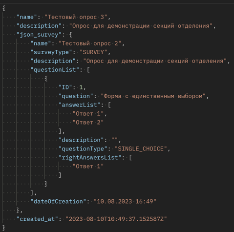
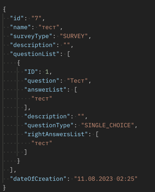

### Инструкция по настройке проекта

Нужно:
1) Открыть папку, в которую будете клонировать репозиторий
2) Открыть эту папкку в консоли и прописать команду \
   ```git clone https://github.com/TagleD/survey.git```
3) Открыть появившуюся папку survey и создать виртуальное окружение
с помощью команды ```virtualenv -p python venv```
4) Активировать виртуальное окружение с помощью команды: ```. venv/bin/activate```
4) Скачать все дополнительные библиотеки: ```pip install -r requirements.txt```
5) Переместиться в source ```cd source ```
6) Настроить в файле source/app/settings.py данные от своей базы данных
7) Применяем все миграции проекта в консоли ./manage.py migrate
8) Прописываем в консоли ./manage.py loaddata fixtures/auth.json
9) Прописываем в коносли ./manage.py loaddata fixtures/webapp.json
10) Прописываем ./manage.py runserver

#### На сайте есть функционал, который доступен только суперпользователю
*Войти в аккаунт суперпользователя можно через кнопку ```Войти``` в меню

1. Логин: superuser  
2. Пароль: rootroot

* Поменять пароль можно через админ-панель, которая доступна по url ```/admin```


<h3>Инструкция по API</h3>

1) Можно вытащить все опросы
    1) GET  ```http://127.0.0.1:8000/api/survey/list```
   2) Можно создать новый опрос
       1) POST ```http://127.0.0.1:8000/api/tasks/```
       2) Для этого нужно отправить body по примеру:
           - 
3) Можно посмотреть отдельный опрос
    1) GET ```http://127.0.0.1:8000/api/survey/20/``` (20 для примера)
4) Можно отредактировать отдельный опрос
    1) PUT ```http://127.0.0.1:8000/api/survey/20/```
    2) Для этого нужно отправить body по примеру выше
5) Можно удалить опрос, если он существует. В ответе придет его id
    1) DELETE ```http://127.0.0.1:8000/api/survey/20/```

6) Можно добавить ответ к опросу
   1) POST ```http://127.0.0.1:8000/api/survey/answer_add```
   2) Для этого нужно отправить body по примеру
    
